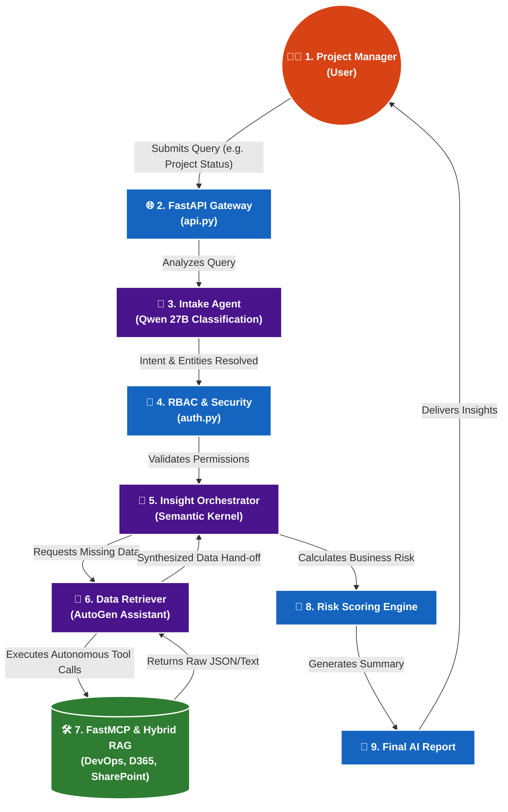

# Intelligence Client Delivery Agent 🚀

An advanced, multi-agent AI system designed to intelligently analyze, synthesize, and report on enterprise project health. By orchestrating across simulated enterprise systems (Azure DevOps, SharePoint, D365) using Microsoft's Semantic Kernel and AutoGen frameworks, this agent provides instant, accurate, and secure insights to project managers.

---

## 🌟 Key Features
- **Multi-Agent Orchestration**: Utilizes **Semantic Kernel** for deterministic pipeline management and **AutoGen** for autonomous tool calling and logic execution.
- **Hybrid RAG Search**: Combines Dense (Semantic) and Sparse (Keyword/BM25) search using Reciprocal Rank Fusion (RRF) for highly accurate information retrieval.
- **Model Context Protocol (MCP)**: Implements FastMCP to seamlessly expose enterprise data (like DevOps issues and D365 budgets) to the LLM as structured tools.
- **Simulated RBAC**: Features Role-Based Access Control enforcing Scope Limitation so users only see the data they are authorized to view.
- **Graceful Degradation**: Built-in fallback mechanisms (e.g., regex fallbacks when the LLM intent classifier fails) ensuring high availability.

---

## 🏗️ Architecture

The architecture seamlessly connects frontend queries through FastAPI into a sophisticated AI backend.



### The Core Flow (Request Lifecycle):
1. **Intake & Intent Classification**: The `IntakeAgent` analyzes user queries to classify the intent (e.g., Project Status, Risk query) using Qwen 27B.
2. **Authorization**: Validates user access against a `USER_REGISTRY`.
3. **Data Retrieval (AutoGen & FastMCP)**: The `DataRetriever` autonomous agent pulls real-time JSON data from simulated API tools.
4. **Scoring & Synthesis**: The `InsightOrchestrator` computes a deterministic Risk Score based on budget overruns and sprint velocity, then commands the LLM to write a final, polished HTML/JSON report.

---

## 💻 Tech Stack
- **Languages**: Python 3.x
- **AI Frameworks**: Semantic Kernel, AutoGen, LlamaIndex
- **LLMs**: Qwen 27B (via Groq API)
- **Vector Database**: ChromaDB (In-memory)
- **Backend API**: FastAPI, Uvicorn
- **Integration Protocol**: FastMCP (Model Context Protocol)

---

## 🚀 Setup & Execution

### Prerequisites
- Python 3.9+ installed.
- A valid Groq API key (for the Qwen 27B model).

### Installation
1. Clone this repository.
2. Create and activate a virtual environment:
   ```bash
   python -m venv venv
   source venv/bin/activate  # On Windows use: venv\Scripts\activate
   ```
3. Install the dependencies:
   ```bash
   pip install -r requirements.txt
   ```
4. Create a `.env` file in the root directory and add your API key:
   ```env
   GROQ_API_KEY=your_groq_api_key_here
   ```

### Running the Project
To run the full pipeline demo locally, simply execute the provided batch script (Windows):
```bash
./run_demo.bat
```
Alternatively, you can run the API server directly:
```bash
uvicorn src.api:app --reload --port 8000
```
Upon execution, the API will launch and the agent will process a mock query (e.g., status for "P-001"), returning a comprehensive HTML project health report.

---

## 📈 Roadmap to Production
This repository currently represents the Proof-of-Concept (PoC) architecture using mock data. 

To view the detailed architectural migration plan for integrating real Microsoft Entra ID (Azure AD), live Azure DevOps APIs, and Azure OpenAI, please check the [Production Migration Roadmap](./production_migration_roadmap.md).

---

## 🔒 Security Note
Ensure your `.env` file containing API keys is never committed to GitHub. A `.gitignore` file is included in this repository to prevent accidental credential leakage.
