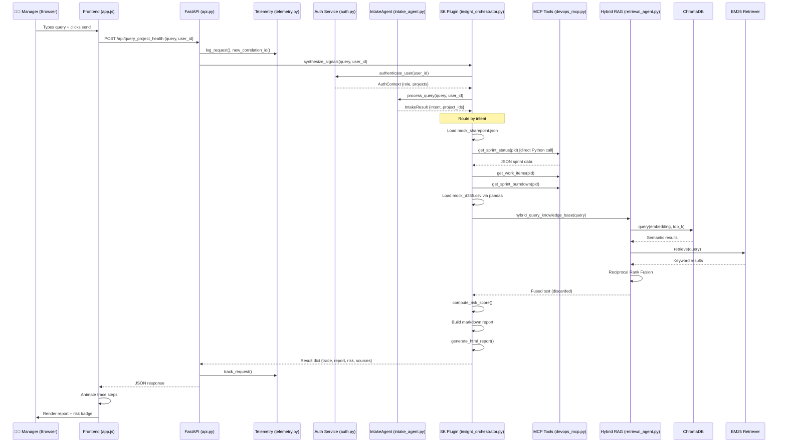

# Intelligent Client Delivery Agent — Capstone Deep Audit

> **Audit Date:** 2026-09-11 | **Repository:** `Intelligence Client Delivery Agent for MAQ Software-Mock Data`
> **Auditor Methodology:** Every source file was read line-by-line. All conclusions are evidence-based with file/line citations.

---

# PHASE 1: REPOSITORY INVENTORY

## 1.1 Project Context (Verified from Code)

| Attribute | Verified Value |
|:---|:---|
| **Business Problem** | Delivery managers manually reconcile data across SharePoint, Azure DevOps, and D365 to prepare project health reports — slow, fragmented, error-prone |
| **Primary Users** | Power BI delivery managers at MAQ Software |
| **Expected Inputs** | Natural language queries via web dashboard (e.g. "What is the health of Project Beta?") |
| **Expected Outputs** | Structured JSON with agent trace, markdown report, risk scores, HTML export |
| **Entry Point** | [`src/api.py`](file:///c:/Users/ShivamSethMAQSoftwar/Downloads/Intelligence%20Client%20Delivery%20Agent%20for%20MAQ%20Software-Mock%20Data/src/api.py) → `uvicorn` on port 8000 |
| **LLM Provider** | **None.** No LLM is called at runtime. All logic is rule-based/algorithmic. |
| **Embedding Provider** | HuggingFace `all-MiniLM-L6-v2` via `sentence-transformers` (local, free) |
| **Vector Database** | ChromaDB (persistent local SQLite) |
| **Data Sources** | Mock JSON/CSV files simulating SharePoint, Azure DevOps, D365 |

## 1.2 Important Folders and Files

### Source Code (`src/`)

| File | Purpose | Lines |
|:---|:---|:---:|
| [`api.py`](file:///c:/Users/ShivamSethMAQSoftwar/Downloads/Intelligence%20Client%20Delivery%20Agent%20for%20MAQ%20Software-Mock%20Data/src/api.py) | FastAPI application entry point; 5 REST endpoints | 267 |
| [`config.py`](file:///c:/Users/ShivamSethMAQSoftwar/Downloads/Intelligence%20Client%20Delivery%20Agent%20for%20MAQ%20Software-Mock%20Data/src/config.py) | Centralized configuration: paths, thresholds, env vars | 62 |
| [`agents/intake_agent.py`](file:///c:/Users/ShivamSethMAQSoftwar/Downloads/Intelligence%20Client%20Delivery%20Agent%20for%20MAQ%20Software-Mock%20Data/src/agents/intake_agent.py) | Pro-code NLP intent classifier + entity extractor | 321 |
| [`agents/retrieval_agent.py`](file:///c:/Users/ShivamSethMAQSoftwar/Downloads/Intelligence%20Client%20Delivery%20Agent%20for%20MAQ%20Software-Mock%20Data/src/agents/retrieval_agent.py) | ChromaDB ingestion, BM25 index, hybrid RAG, AutoGen agent wrapper | 456 |
| [`orchestrator/insight_orchestrator.py`](file:///c:/Users/ShivamSethMAQSoftwar/Downloads/Intelligence%20Client%20Delivery%20Agent%20for%20MAQ%20Software-Mock%20Data/src/orchestrator/insight_orchestrator.py) | Semantic Kernel plugin, risk scoring, report generation, pipeline orchestration | 977 |
| [`mcp_server/devops_mcp.py`](file:///c:/Users/ShivamSethMAQSoftwar/Downloads/Intelligence%20Client%20Delivery%20Agent%20for%20MAQ%20Software-Mock%20Data/src/mcp_server/devops_mcp.py) | FastMCP tool server with 5 DevOps tools | 158 |
| [`utils/auth.py`](file:///c:/Users/ShivamSethMAQSoftwar/Downloads/Intelligence%20Client%20Delivery%20Agent%20for%20MAQ%20Software-Mock%20Data/src/utils/auth.py) | Simulated Entra ID auth + RBAC | 135 |
| [`utils/telemetry.py`](file:///c:/Users/ShivamSethMAQSoftwar/Downloads/Intelligence%20Client%20Delivery%20Agent%20for%20MAQ%20Software-Mock%20Data/src/utils/telemetry.py) | Structured telemetry + App Insights integration | 239 |

### Data (`data/`)

| File | Purpose |
|:---|:---|
| `mock_sharepoint.json` | 5 project metadata records simulating SharePoint |
| `mock_devops.json` | Sprint data, work items for 5 projects simulating Azure DevOps |
| `mock_d365.csv` | 27 rows of timesheet/financial data simulating D365 |
| `chroma_db/` | Persistent ChromaDB SQLite store with ingested embeddings |

### Frontend (`frontend/`)

| File | Purpose |
|:---|:---|
| `index.html` | Single-page web dashboard (348 lines) |
| `app.js` | Client-side JS: chat UI, trace animation, API calls (300 lines) |
| `style.css` | Dark-themed UI styling (23KB) |

### Tests (`tests/`)

| File | Tests | Purpose |
|:---|:---:|:---|
| `test_auth.py` | 8 | Auth, RBAC, project access |
| `test_intake_agent.py` | 9 | Intent classification, entity extraction |
| `test_risk_scoring.py` | 7 | Risk algorithm correctness |
| `conftest.py` | — | Path setup |

### CI/CD & Docs

| File | Purpose |
|:---|:---|
| [`azure-pipelines.yml`](file:///c:/Users/ShivamSethMAQSoftwar/Downloads/Intelligence%20Client%20Delivery%20Agent%20for%20MAQ%20Software-Mock%20Data/azure-pipelines.yml) | 3-stage Azure DevOps pipeline |
| `project_architecture.md` | Mermaid architecture diagram + component breakdown |
| `code_lifecycle.md` | Technical component walkthrough |
| `request_lifecycle.md` | Step-by-step query trace for Project Beta |
| `demo_and_presentation_guide.md` | 30-minute demo script |
| `run_demo.bat` | Windows batch launcher |
| `architecture_diagram.svg` | Visual architecture diagram |

## 1.3 Package Usage Analysis

| Package | Installed | Imported | Object Created | Runtime Called | Verdict |
|:---|:---:|:---:|:---:|:---:|:---|
| `fastapi` | ✅ | ✅ | ✅ `FastAPI()` | ✅ serves HTTP | **Fully Used** |
| `semantic-kernel` | ✅ | ✅ `Kernel`, `kernel_function` | ✅ `Kernel()`, plugin registered | ✅ function retrieved + invoked | **Fully Used** |
| `pyautogen` / `autogen-agentchat` | ✅ | ✅ `AssistantAgent` | ✅ `AssistantAgent()` created | ⚠️ `.name` accessed; **not invoked as an agent** (see below) | **Partially Used** |
| `llama-index-core` | ✅ | ✅ `TextNode` | ✅ nodes created | ✅ BM25 retriever queried | **Fully Used** |
| `llama-index-retrievers-bm25` | ✅ | ✅ `BM25Retriever` | ✅ `from_defaults()` | ✅ `.retrieve()` called | **Fully Used** |
| `chromadb` | ✅ | ✅ | ✅ `PersistentClient()` | ✅ `.upsert()`, `.query()` | **Fully Used** |
| `sentence-transformers` | ✅ | ✅ | ✅ `SentenceTransformer()` | ✅ `.encode()` | **Fully Used** |
| `fastmcp` | ✅ | ✅ `FastMCP` | ✅ `FastMCP("DevOpsServer")` | ⚠️ Tools called as **direct Python functions**, not via MCP transport | **Partially Used** |
| `azure-monitor-opentelemetry` | ✅ | ✅ `configure_azure_monitor` | ⚠️ Only if conn string set | ⚠️ Falls back to JSONL file | **Configured, Degraded** |
| `mcp` | ✅ | ❌ | ❌ | ❌ | **Installed, Not Used** |
| `pandas` | ✅ | ✅ | ✅ | ✅ `.read_csv()`, `.groupby()` | **Fully Used** |
| `pydantic` | ✅ | ✅ | ✅ `BaseModel` | ✅ request validation | **Fully Used** |
| `requests` | ✅ | ❌ | ❌ | ❌ | **Installed, Not Used** |
| `httpx` | ✅ | ❌ | ❌ | ❌ | **Installed, Not Used** |
| `pytest` | ✅ | — | — | ✅ via CLI | **Used (test runner)** |

> [!IMPORTANT]
> **Critical Finding — AutoGen:** The `AssistantAgent` is instantiated ([`retrieval_agent.py:423-434`](file:///c:/Users/ShivamSethMAQSoftwar/Downloads/Intelligence%20Client%20Delivery%20Agent%20for%20MAQ%20Software-Mock%20Data/src/agents/retrieval_agent.py#L423-L434)) but **never invoked as an agent**. In [`insight_orchestrator.py:537-554`](file:///c:/Users/ShivamSethMAQSoftwar/Downloads/Intelligence%20Client%20Delivery%20Agent%20for%20MAQ%20Software-Mock%20Data/src/orchestrator/insight_orchestrator.py#L537-L554), the orchestrator calls `get_retrieval_agent()`, accesses `.name`, then calls `hybrid_query_knowledge_base()` directly — bypassing AutoGen's agent execution entirely. The agent is a **wrapper with no runtime agency**.

> [!IMPORTANT]
> **Critical Finding — FastMCP:** MCP tools are defined with `@mcp.tool()` decorator ([`devops_mcp.py:41-152`](file:///c:/Users/ShivamSethMAQSoftwar/Downloads/Intelligence%20Client%20Delivery%20Agent%20for%20MAQ%20Software-Mock%20Data/src/mcp_server/devops_mcp.py#L41-L152)), but the orchestrator imports and calls them as **regular Python functions** ([`insight_orchestrator.py:34-37`](file:///c:/Users/ShivamSethMAQSoftwar/Downloads/Intelligence%20Client%20Delivery%20Agent%20for%20MAQ%20Software-Mock%20Data/src/orchestrator/insight_orchestrator.py#L34-L37)). No MCP client, no stdio/SSE transport, no tool discovery protocol. The MCP server (`mcp.run()`) is only executed if `devops_mcp.py` is run as `__main__` — it is never started during normal API operation.

## 1.4 Dead / Unused Items

| Item | Location | Status |
|:---|:---|:---|
| `requests` package | `requirements.txt` | Installed, never imported |
| `httpx` package | `requirements.txt` | Installed, never imported |
| `mcp` package | `requirements.txt` | Installed, never imported (only `fastmcp` is used) |
| `query_knowledge_base()` | `retrieval_agent.py:370` | Defined as backward-compat wrapper, not called externally |
| `track_event()` | `telemetry.py:105` | Defined, only called from `log_request()` wrapper |
| `track_dependency()` | `telemetry.py:122` | Defined, never called from main pipeline |
| `timed_dependency()` | `telemetry.py:219` | Context manager defined, never used |
| `sk_function` variable | `insight_orchestrator.py:966` | Retrieved from kernel but never used; direct method call on L968 instead |

---

# PHASE 2: END-TO-END EXECUTION FLOW

## 2.A Beginner-Friendly Flow

1. **Manager types a question** in the web dashboard (e.g., "What is the health of Project Beta?")
2. **Frontend sends it** to the FastAPI backend via HTTP POST with user_id
3. **Auth Service checks** who the user is and what projects they can see
4. **Intake Agent reads** the question and figures out the intent (project health) and target (Project Beta = P-002)
5. **Orchestrator loads data** from three sources: SharePoint (project metadata), DevOps (sprint/bugs), D365 (costs/hours)
6. **Hybrid RAG searches** the knowledge base for additional context using both keyword and meaning-based search
7. **Risk algorithm calculates** a 0-100 score based on blockers, bugs, velocity, and budget
8. **Report is generated** in markdown and HTML formats
9. **Response is sent back** to the frontend with the report, risk score, and a full trace of every step
10. **Frontend animates** the trace and displays the formatted report

## 2.B Detailed Technical Flow

### Trigger: `POST /api/query_project_health` with `{"query": "...", "user_id": "mgr123"}`

| Step | Trigger | Handler | Input | Processing | Output | Next | Failure | Type |
|:---:|:---|:---|:---|:---|:---|:---|:---|:---|
| 1 | HTTP POST | [`api.py:193-238`](file:///c:/Users/ShivamSethMAQSoftwar/Downloads/Intelligence%20Client%20Delivery%20Agent%20for%20MAQ%20Software-Mock%20Data/src/api.py#L193-L238) `query_project_health()` | `QueryRequest(query, user_id)` | Pydantic validation, telemetry logging, correlation ID | Calls `synthesize_signals()` | Step 2 | HTTP 500 + `track_exception()` | Rule-based |
| 2 | Function call | [`insight_orchestrator.py:957-971`](file:///c:/Users/ShivamSethMAQSoftwar/Downloads/Intelligence%20Client%20Delivery%20Agent%20for%20MAQ%20Software-Mock%20Data/src/orchestrator/insight_orchestrator.py#L957-L971) `synthesize_signals()` | query, user_id | Gets SK plugin, calls `synthesize_project_health()` directly | Delegates to plugin method | Step 3 | Exception propagates | Rule-based |
| 3 | Method call | [`insight_orchestrator.py:410-484`](file:///c:/Users/ShivamSethMAQSoftwar/Downloads/Intelligence%20Client%20Delivery%20Agent%20for%20MAQ%20Software-Mock%20Data/src/orchestrator/insight_orchestrator.py#L410-L484) `synthesize_project_health()` | query, user_id | Auth → Intake → Intent routing | Routes to `_single_project_report()` or `_portfolio_report()` | Step 4 | No explicit error handling | Rule-based |
| 4 | Method call | [`auth.py:95-134`](file:///c:/Users/ShivamSethMAQSoftwar/Downloads/Intelligence%20Client%20Delivery%20Agent%20for%20MAQ%20Software-Mock%20Data/src/utils/auth.py#L95-L134) `authenticate_user()` | user_id | Dict lookup in `USER_REGISTRY` | `AuthContext` dataclass | Step 5 | Unknown user → viewer role | Rule-based |
| 5 | Method call | [`intake_agent.py:197-249`](file:///c:/Users/ShivamSethMAQSoftwar/Downloads/Intelligence%20Client%20Delivery%20Agent%20for%20MAQ%20Software-Mock%20Data/src/agents/intake_agent.py#L197-L249) `process_query()` | query, user_id | Regex pattern matching for intent + alias matching for entities | `IntakeResult(intent, project_ids, confidence)` | Step 6 | Falls back to `PORTFOLIO_OVERVIEW` | Rule-based |
| 6 | Method call | [`insight_orchestrator.py:698-944`](file:///c:/Users/ShivamSethMAQSoftwar/Downloads/Intelligence%20Client%20Delivery%20Agent%20for%20MAQ%20Software-Mock%20Data/src/orchestrator/insight_orchestrator.py#L698-L944) `_single_project_report()` | project_id, query, auth_ctx | RBAC check → Load SP → MCP tools → D365 → Hybrid RAG → Risk → Report | Full result dict | API response | Access Denied if RBAC fails | Rule-based |
| 7 | Direct call | [`devops_mcp.py:42-57`](file:///c:/Users/ShivamSethMAQSoftwar/Downloads/Intelligence%20Client%20Delivery%20Agent%20for%20MAQ%20Software-Mock%20Data/src/mcp_server/devops_mcp.py#L42-L57) `get_sprint_status()` | project_id | JSON file read + filter | JSON string | Parsed by orchestrator | Returns `{"error": "..."}` | Deterministic |
| 8 | Direct call | [`retrieval_agent.py:335-367`](file:///c:/Users/ShivamSethMAQSoftwar/Downloads/Intelligence%20Client%20Delivery%20Agent%20for%20MAQ%20Software-Mock%20Data/src/agents/retrieval_agent.py#L335-L367) `hybrid_query_knowledge_base()` | query | ChromaDB semantic search + BM25 keyword search + RRF fusion | Concatenated text | Stored in trace (not used in report generation) | Returns "No relevant information" | Hybrid (embedding + keyword) |
| 9 | Function call | [`insight_orchestrator.py:99-164`](file:///c:/Users/ShivamSethMAQSoftwar/Downloads/Intelligence%20Client%20Delivery%20Agent%20for%20MAQ%20Software-Mock%20Data/src/orchestrator/insight_orchestrator.py#L99-L164) `compute_risk_score()` | blockers, bugs, velocity, cost | Weighted algorithm: 30%+20%+20%+30% | (score, status, color, breakdown) | Report generator | Division-safe with max(1, x) | Deterministic |
| 10 | Function call | [`insight_orchestrator.py:171-388`](file:///c:/Users/ShivamSethMAQSoftwar/Downloads/Intelligence%20Client%20Delivery%20Agent%20for%20MAQ%20Software-Mock%20Data/src/orchestrator/insight_orchestrator.py#L171-L388) `generate_html_report()` | report_data dict | Markdown → HTML conversion, styling, file save | HTML string | Included in result dict | Writes to `reports/` | Deterministic |

> [!WARNING]
> **Key observation:** The RAG context returned by `hybrid_query_knowledge_base()` is **not used in the final report**. At [`insight_orchestrator.py:605`](file:///c:/Users/ShivamSethMAQSoftwar/Downloads/Intelligence%20Client%20Delivery%20Agent%20for%20MAQ%20Software-Mock%20Data/src/orchestrator/insight_orchestrator.py#L605) and [`825`](file:///c:/Users/ShivamSethMAQSoftwar/Downloads/Intelligence%20Client%20Delivery%20Agent%20for%20MAQ%20Software-Mock%20Data/src/orchestrator/insight_orchestrator.py#L825), `_run_hybrid_rag()` is called but its return value is discarded. The report is generated entirely from structured data loaded directly from files. The RAG system functions correctly, but its output does not influence the final response.

## 2.C Mermaid Sequence Diagram (Verified from Code)

---

# PHASE 3: CONCEPT-BY-CONCEPT MAPPING

## A. AGENT FOUNDATIONS

### A1. AI Agent vs Normal LLM Application
- **Status:** Conceptually Present
- **Confidence:** Medium
- **Evidence:** The system processes natural language, classifies intent, routes to specialized modules, and generates reports. However, **no LLM is used at runtime**. All reasoning is regex-based pattern matching and deterministic algorithms. The system is closer to a sophisticated rule-based pipeline than an LLM-powered agent.
- **Gap:** No LLM reasoning, no generative capability, no dynamic planning
- **Demo explanation:** "Our system demonstrates agent architecture — perception (intake), planning (routing), action (data retrieval), reporting — using a rule-based free-tier stack. In production, adding an LLM would enable natural language reasoning."

### A2. Agentic-first vs Traditional Architecture
- **Status:** Partially Implemented
- **Confidence:** Medium
- **Evidence:** The architecture is designed with agent roles (Intake, Retrieval, Orchestrator). The `AgentTrace` class ([`insight_orchestrator.py:66-92`](file:///c:/Users/ShivamSethMAQSoftwar/Downloads/Intelligence%20Client%20Delivery%20Agent%20for%20MAQ%20Software-Mock%20Data/src/orchestrator/insight_orchestrator.py#L66-L92)) records each step as an agent action. However, agents don't autonomously decide; the orchestrator follows a fixed deterministic path.
- **Gap:** No autonomous decision-making, no dynamic tool selection

### A3. Perception → Planning → Action → Reflection Loop
- **Status:** Partially Implemented
- **Confidence:** Medium
- **Where:** 
  - **Perception:** [`IntakeAgent.process_query()`](file:///c:/Users/ShivamSethMAQSoftwar/Downloads/Intelligence%20Client%20Delivery%20Agent%20for%20MAQ%20Software-Mock%20Data/src/agents/intake_agent.py#L197-L249) — classifies intent and extracts entities
  - **Planning:** [`synthesize_project_health()`](file:///c:/Users/ShivamSethMAQSoftwar/Downloads/Intelligence%20Client%20Delivery%20Agent%20for%20MAQ%20Software-Mock%20Data/src/orchestrator/insight_orchestrator.py#L410-L484) — routes by intent type
  - **Action:** Data retrieval from 3 sources + hybrid RAG + risk computation
  - **Reflection:** ❌ **Not implemented.** No self-correction, retry, quality check, or feedback loop.
- **Gap:** Missing reflection/self-correction stage

### A4. Autonomous vs Assistive Agent
- **Status:** Fully Implemented (Assistive)
- **Confidence:** High
- **Evidence:** The agent assists managers by answering queries and generating reports. It does not take autonomous actions (no ticket creation, no email sending, no approval routing). This is an **assistive agent** by design.

### A5. Single-agent vs Multi-agent System
- **Status:** Conceptually Present (claimed multi-agent; runtime is single-pipeline)
- **Confidence:** High
- **Evidence:** Three named agents exist (Intake, Retrieval, Orchestrator), but they execute as **sequential function calls within a single Python process**. There is no inter-agent messaging, no independent execution, no negotiation, no parallel processing. The `IntakeAgent` is a class instantiated inside `ProjectHealthPlugin.__init__()` ([L404](file:///c:/Users/ShivamSethMAQSoftwar/Downloads/Intelligence%20Client%20Delivery%20Agent%20for%20MAQ%20Software-Mock%20Data/src/orchestrator/insight_orchestrator.py#L404)). The AutoGen agent is created but never invoked.
- **Gap:** True multi-agent requires independent agent execution, message passing, or orchestrated group chat — none exist here.

### A6. Agent Maturity Model
- **Status:** Not Implemented
- **Confidence:** High
- **Evidence:** No explicit maturity model documentation or progressive capability levels.

### A7. Stateless vs Stateful Agents
- **Status:** Partially Implemented (Stateless)
- **Confidence:** High
- **Evidence:** Each request is processed independently. No chat history, no session memory, no state persistence across requests. The ChromaDB store persists data but does not maintain conversational state.
- **Gap:** No stateful conversation tracking

## B. REASONING AND PLANNING

### B1. Chain of Thought
- **Status:** Not Implemented
- **Confidence:** High
- **Evidence:** No LLM is invoked, so no chain-of-thought prompting exists. The `AgentTrace` records deterministic steps, not intermediate reasoning.

### B2. Tree of Thought
- **Status:** Not Implemented
- **Confidence:** High

### B3. Least-to-Most Planning
- **Status:** Not Implemented
- **Confidence:** High

### B4. Workflow Decomposition
- **Status:** Partially Implemented
- **Confidence:** High
- **Evidence:** The orchestrator decomposes queries into steps: auth → intent → data loading → RAG → risk → report. This is a fixed pipeline, not dynamic decomposition. See the intent routing at [`insight_orchestrator.py:450-484`](file:///c:/Users/ShivamSethMAQSoftwar/Downloads/Intelligence%20Client%20Delivery%20Agent%20for%20MAQ%20Software-Mock%20Data/src/orchestrator/insight_orchestrator.py#L450-L484).

### B5. Policy-constrained Reasoning
- **Status:** Partially Implemented
- **Confidence:** Medium
- **Evidence:** Risk scoring uses fixed thresholds ([`config.py:28-38`](file:///c:/Users/ShivamSethMAQSoftwar/Downloads/Intelligence%20Client%20Delivery%20Agent%20for%20MAQ%20Software-Mock%20Data/src/config.py#L28-L38)). RBAC enforces access policies. No dynamic policy evaluation.

### B6. Human-in-the-Loop Checkpoints
- **Status:** Not Implemented
- **Confidence:** High
- **Evidence:** No approval gates, confirmation prompts, or escalation mechanisms in the runtime pipeline.

### B7. Reflection, Self-correction, Retry
- **Status:** Not Implemented
- **Confidence:** High
- **Evidence:** No retry logic, no quality validation, no self-correction in any agent.

## C. PROMPT ENGINEERING AND SAFETY

### C1. System Prompts
- **Status:** Not Implemented
- **Confidence:** High
- **Evidence:** No LLM is called, so no system prompts exist. The `IntakeAgent` uses regex patterns, not prompt engineering.

### C2-C3. Context-aware Prompt Enhancement / Query Rewriting
- **Status:** Not Implemented
- **Confidence:** High

### C4. Prompt Libraries / C5. Prompt Versioning
- **Status:** Not Implemented
- **Confidence:** High

### C6. Language Detection
- **Status:** Not Implemented
- **Confidence:** High

### C7. PII Detection and Masking
- **Status:** Not Implemented
- **Confidence:** High
- **Evidence:** No PII scanning (no Presidio or equivalent). User queries are logged in full to `telemetry_log.jsonl` and standard logging.

### C8. Prompt Injection Defenses
- **Status:** Not Applicable
- **Confidence:** High
- **Evidence:** Since no LLM is used, prompt injection is not a direct attack vector. However, user input goes directly into regex matching without sanitization — no risk in current architecture, but would be critical if LLM were added.

### C9. Fallback Strategies
- **Status:** Partially Implemented
- **Confidence:** High
- **Evidence:** 
  - Unknown intent → falls back to `PORTFOLIO_OVERVIEW` ([`intake_agent.py:229-231`](file:///c:/Users/ShivamSethMAQSoftwar/Downloads/Intelligence%20Client%20Delivery%20Agent%20for%20MAQ%20Software-Mock%20Data/src/agents/intake_agent.py#L229-L231))
  - Unknown user → grants `viewer` role ([`auth.py:128-134`](file:///c:/Users/ShivamSethMAQSoftwar/Downloads/Intelligence%20Client%20Delivery%20Agent%20for%20MAQ%20Software-Mock%20Data/src/utils/auth.py#L128-L134))
  - MCP tool not found → returns error JSON, orchestrator sets default values ([`insight_orchestrator.py:751-755`](file:///c:/Users/ShivamSethMAQSoftwar/Downloads/Intelligence%20Client%20Delivery%20Agent%20for%20MAQ%20Software-Mock%20Data/src/orchestrator/insight_orchestrator.py#L751-L755))

### C10. Input Validation
- **Status:** Partially Implemented
- **Confidence:** High
- **Evidence:** Pydantic `BaseModel` validates request structure ([`api.py:65-72`](file:///c:/Users/ShivamSethMAQSoftwar/Downloads/Intelligence%20Client%20Delivery%20Agent%20for%20MAQ%20Software-Mock%20Data/src/api.py#L65-L72)). No content-level validation (length limits, character filtering, profanity).

### C11. Output Validation / C12. Guardrails
- **Status:** Not Implemented
- **Confidence:** High

## D. FRAMEWORKS

### D1. Semantic Kernel
- **Status:** Fully Implemented
- **Confidence:** High
- **Evidence:**
  - Import: `from semantic_kernel import Kernel` and `from semantic_kernel.functions import kernel_function` ([L25-26](file:///c:/Users/ShivamSethMAQSoftwar/Downloads/Intelligence%20Client%20Delivery%20Agent%20for%20MAQ%20Software-Mock%20Data/src/orchestrator/insight_orchestrator.py#L25-L26))
  - Kernel instance: `_kernel = Kernel()` ([L951](file:///c:/Users/ShivamSethMAQSoftwar/Downloads/Intelligence%20Client%20Delivery%20Agent%20for%20MAQ%20Software-Mock%20Data/src/orchestrator/insight_orchestrator.py#L951))
  - Plugin registered: `_kernel.add_plugin(_health_plugin, plugin_name="ProjectHealthPlugin")` ([L953](file:///c:/Users/ShivamSethMAQSoftwar/Downloads/Intelligence%20Client%20Delivery%20Agent%20for%20MAQ%20Software-Mock%20Data/src/orchestrator/insight_orchestrator.py#L953))
  - `@kernel_function` decorator on `synthesize_project_health` ([L406-409](file:///c:/Users/ShivamSethMAQSoftwar/Downloads/Intelligence%20Client%20Delivery%20Agent%20for%20MAQ%20Software-Mock%20Data/src/orchestrator/insight_orchestrator.py#L406-L409))
  - Plugin retrieved: `plugin_functions = _kernel.get_plugin("ProjectHealthPlugin")` ([L965](file:///c:/Users/ShivamSethMAQSoftwar/Downloads/Intelligence%20Client%20Delivery%20Agent%20for%20MAQ%20Software-Mock%20Data/src/orchestrator/insight_orchestrator.py#L965))
- **Limitation:** SK is used as a plugin registry only. No SK planners, no SK memory, no SK connectors, no LLM integration through SK. The function is called directly on the plugin instance ([L968](file:///c:/Users/ShivamSethMAQSoftwar/Downloads/Intelligence%20Client%20Delivery%20Agent%20for%20MAQ%20Software-Mock%20Data/src/orchestrator/insight_orchestrator.py#L968)), not through `kernel.invoke()`.

### D2. AutoGen
- **Status:** Configured but Not Actively Used
- **Confidence:** High
- **Evidence:**
  - Import: `from autogen_agentchat.agents import AssistantAgent` ([L418](file:///c:/Users/ShivamSethMAQSoftwar/Downloads/Intelligence%20Client%20Delivery%20Agent%20for%20MAQ%20Software-Mock%20Data/src/agents/retrieval_agent.py#L418))
  - Agent created: `AssistantAgent(name="DataRetriever", model_client=MockModelClient(), tools=[...])` ([L423-434](file:///c:/Users/ShivamSethMAQSoftwar/Downloads/Intelligence%20Client%20Delivery%20Agent%20for%20MAQ%20Software-Mock%20Data/src/agents/retrieval_agent.py#L423-L434))
  - **Not invoked:** The orchestrator calls `get_retrieval_agent()` but only accesses `.name` ([`insight_orchestrator.py:540-542`](file:///c:/Users/ShivamSethMAQSoftwar/Downloads/Intelligence%20Client%20Delivery%20Agent%20for%20MAQ%20Software-Mock%20Data/src/orchestrator/insight_orchestrator.py#L540-L542)). The actual retrieval is done by calling `hybrid_query_knowledge_base()` directly, not through the agent.
  - Uses `MockModelClient` — no real LLM capability
- **Verdict:** AutoGen is used as a **label** on existing retrieval logic. The `AssistantAgent` never processes a message, selects tools, or exercises any agency.

### D3. LangChain
- **Status:** Not Implemented
- **Confidence:** High

### D4. LangGraph
- **Status:** Not Implemented
- **Confidence:** High

### D5. CrewAI
- **Status:** Not Implemented
- **Confidence:** High

### D6. LlamaIndex
- **Status:** Partially Implemented
- **Confidence:** High
- **Evidence:** Only the BM25 retriever component is used: `BM25Retriever.from_defaults()` ([L286-289](file:///c:/Users/ShivamSethMAQSoftwar/Downloads/Intelligence%20Client%20Delivery%20Agent%20for%20MAQ%20Software-Mock%20Data/src/agents/retrieval_agent.py#L286-L289)) and `TextNode` for document modeling. Core LlamaIndex features (indices, query engines, response synthesizers) are not used.

### D7. Copilot Studio
- **Status:** Not Implemented
- **Confidence:** High
- **Evidence:** The `IntakeAgent` is described as a pro-code replacement for Copilot Studio ([`intake_agent.py:1-17`](file:///c:/Users/ShivamSethMAQSoftwar/Downloads/Intelligence%20Client%20Delivery%20Agent%20for%20MAQ%20Software-Mock%20Data/src/agents/intake_agent.py#L1-L17)). No Copilot Studio artifacts exist.

### D8. Microsoft Foundry Agents
- **Status:** Not Implemented
- **Confidence:** High

## E. MEMORY

### E1-E4. Short-term / Long-term / Episodic / Semantic Memory
- **Status:** Not Implemented (Short-term: ChromaDB is semantic-like but not conversational memory)
- **Confidence:** High
- **Evidence:** ChromaDB stores document embeddings for retrieval, which is a form of **semantic knowledge store** — but there is no chat history, no episodic memory of past interactions, no user-specific memory.

### E5. Chat History
- **Status:** Not Implemented
- **Confidence:** High
- **Evidence:** Each request is independent. No conversation context is maintained.

### E6. Persistent vs In-memory Storage
- **Status:** Partially Implemented
- **Confidence:** High
- **Evidence:** ChromaDB uses `PersistentClient` with SQLite ([`retrieval_agent.py:59`](file:///c:/Users/ShivamSethMAQSoftwar/Downloads/Intelligence%20Client%20Delivery%20Agent%20for%20MAQ%20Software-Mock%20Data/src/agents/retrieval_agent.py#L59)). BM25 nodes are in-memory only ([`retrieval_agent.py:63`](file:///c:/Users/ShivamSethMAQSoftwar/Downloads/Intelligence%20Client%20Delivery%20Agent%20for%20MAQ%20Software-Mock%20Data/src/agents/retrieval_agent.py#L63)), rebuilt on each module import.

## F. RAG AND RETRIEVAL

### F1. Document Ingestion
- **Status:** Fully Implemented
- **Confidence:** High
- **Evidence:** [`ingest_data()`](file:///c:/Users/ShivamSethMAQSoftwar/Downloads/Intelligence%20Client%20Delivery%20Agent%20for%20MAQ%20Software-Mock%20Data/src/agents/retrieval_agent.py#L188-L236) at module import time. Loads SharePoint JSON, D365 CSV, DevOps JSON → builds text documents → embeds → upserts to ChromaDB + creates BM25 nodes.

### F2. Chunking Strategy
- **Status:** Partially Implemented
- **Confidence:** Medium
- **Evidence:** Documents are **one chunk per logical record** (one per project from SharePoint, one per project + one per resource-row from D365, one per project from DevOps). See [`_build_all_documents()`](file:///c:/Users/ShivamSethMAQSoftwar/Downloads/Intelligence%20Client%20Delivery%20Agent%20for%20MAQ%20Software-Mock%20Data/src/agents/retrieval_agent.py#L75-L185). No configurable chunk size or overlap — the data is small enough that each record is a single chunk.

### F3. Embedding Model
- **Status:** Fully Implemented
- **Confidence:** High
- **Evidence:** `SentenceTransformer("all-MiniLM-L6-v2")` ([`retrieval_agent.py:56`](file:///c:/Users/ShivamSethMAQSoftwar/Downloads/Intelligence%20Client%20Delivery%20Agent%20for%20MAQ%20Software-Mock%20Data/src/agents/retrieval_agent.py#L56)), `.encode()` called for ingestion ([L204](file:///c:/Users/ShivamSethMAQSoftwar/Downloads/Intelligence%20Client%20Delivery%20Agent%20for%20MAQ%20Software-Mock%20Data/src/agents/retrieval_agent.py#L204)) and query time ([L253](file:///c:/Users/ShivamSethMAQSoftwar/Downloads/Intelligence%20Client%20Delivery%20Agent%20for%20MAQ%20Software-Mock%20Data/src/agents/retrieval_agent.py#L253)).

### F4. Vector Store — ChromaDB
- **Status:** Fully Implemented
- **Confidence:** High
- **Evidence:** `chromadb.PersistentClient(path=CHROMA_DB_PATH)` ([L59](file:///c:/Users/ShivamSethMAQSoftwar/Downloads/Intelligence%20Client%20Delivery%20Agent%20for%20MAQ%20Software-Mock%20Data/src/agents/retrieval_agent.py#L59)), `.upsert()` for ingestion ([L205-210](file:///c:/Users/ShivamSethMAQSoftwar/Downloads/Intelligence%20Client%20Delivery%20Agent%20for%20MAQ%20Software-Mock%20Data/src/agents/retrieval_agent.py#L205-L210)), `.query()` for search ([L259-263](file:///c:/Users/ShivamSethMAQSoftwar/Downloads/Intelligence%20Client%20Delivery%20Agent%20for%20MAQ%20Software-Mock%20Data/src/agents/retrieval_agent.py#L259-L263)).

### F5. BM25 Keyword Search
- **Status:** Fully Implemented
- **Confidence:** High
- **Evidence:** LlamaIndex `BM25Retriever.from_defaults(nodes=_bm25_nodes)` ([L286-288](file:///c:/Users/ShivamSethMAQSoftwar/Downloads/Intelligence%20Client%20Delivery%20Agent%20for%20MAQ%20Software-Mock%20Data/src/agents/retrieval_agent.py#L286-L288)), `.retrieve(query)` called ([L290](file:///c:/Users/ShivamSethMAQSoftwar/Downloads/Intelligence%20Client%20Delivery%20Agent%20for%20MAQ%20Software-Mock%20Data/src/agents/retrieval_agent.py#L290)).

### F6. Hybrid RAG + Reciprocal Rank Fusion
- **Status:** Fully Implemented
- **Confidence:** High
- **Evidence:** [`_reciprocal_rank_fusion()`](file:///c:/Users/ShivamSethMAQSoftwar/Downloads/Intelligence%20Client%20Delivery%20Agent%20for%20MAQ%20Software-Mock%20Data/src/agents/retrieval_agent.py#L305-L332) implements RRF with score = Σ(1/(k+rank)). [`hybrid_query_knowledge_base()`](file:///c:/Users/ShivamSethMAQSoftwar/Downloads/Intelligence%20Client%20Delivery%20Agent%20for%20MAQ%20Software-Mock%20Data/src/agents/retrieval_agent.py#L335-L367) calls both search methods and fuses results.

### F7. Metadata Filters
- **Status:** Partially Implemented
- **Confidence:** High
- **Evidence:** `_chromadb_search()` accepts `source_filter` parameter ([`retrieval_agent.py:244-263`](file:///c:/Users/ShivamSethMAQSoftwar/Downloads/Intelligence%20Client%20Delivery%20Agent%20for%20MAQ%20Software-Mock%20Data/src/agents/retrieval_agent.py#L244-L263)) with `where={"source": source_filter}`. However, **no user_id-based filtering is applied to retrieval** — RBAC is enforced at the report-generation level, not at the retrieval level.

### F8. Re-ranking
- **Status:** Not Implemented (RRF is fusion, not re-ranking)
- **Confidence:** High
- **Evidence:** RRF fuses two ranked lists but does not re-rank results using a cross-encoder or other re-ranker model.

### F9. Grounding / Source Citation
- **Status:** Partially Implemented
- **Confidence:** Medium
- **Evidence:** `sources_used` list is populated and returned ([`insight_orchestrator.py:547`](file:///c:/Users/ShivamSethMAQSoftwar/Downloads/Intelligence%20Client%20Delivery%20Agent%20for%20MAQ%20Software-Mock%20Data/src/orchestrator/insight_orchestrator.py#L547)). Source chips displayed in UI. However, citations are at the **system level** ("SharePoint", "Azure DevOps (MCP)"), not document-level.

### F10. Hallucination Prevention
- **Status:** Fully Implemented (by design)
- **Confidence:** High
- **Evidence:** No LLM generates text. All output is template-based from structured data. **Hallucination is impossible** in the current architecture because no generative model is used.

### RAG Pipeline Completeness

| Stage | Status | Evidence |
|:---|:---|:---|
| Source Data | ✅ | Mock JSON/CSV files |
| Loading | ✅ | `_build_all_documents()` |
| Cleaning | ❌ | No text cleaning/normalization |
| Chunking | ⚠️ Partial | One-record-per-chunk, no splitting |
| Embedding | ✅ | `SentenceTransformer.encode()` |
| Indexing | ✅ | ChromaDB `.upsert()` + BM25 nodes |
| Query Processing | ❌ | No query expansion or rewriting |
| Retrieval | ✅ | Both semantic and BM25 |
| Filtering | ⚠️ | Source filter available; no user_id filter |
| Re-ranking | ❌ | Not implemented |
| Context Construction | ❌ | RAG results discarded, not used in report |
| LLM Generation | ❌ | No LLM; template-based |
| Citation | ⚠️ | System-level sources only |

## G. TOOLS, PLUGINS, AND ACTIONS

### G1. Tool-calling Fundamentals
- **Status:** Partially Implemented
- **Confidence:** High
- **Evidence:** 5 MCP tools defined with `@mcp.tool()` ([`devops_mcp.py:41-152`](file:///c:/Users/ShivamSethMAQSoftwar/Downloads/Intelligence%20Client%20Delivery%20Agent%20for%20MAQ%20Software-Mock%20Data/src/mcp_server/devops_mcp.py#L41-L152)). The SK plugin uses `@kernel_function` ([`insight_orchestrator.py:406`](file:///c:/Users/ShivamSethMAQSoftwar/Downloads/Intelligence%20Client%20Delivery%20Agent%20for%20MAQ%20Software-Mock%20Data/src/orchestrator/insight_orchestrator.py#L406)). However, tool selection is **hard-coded**, not dynamic.

### G2. Tool Schema Design (JSON)
- **Status:** Not Implemented
- **Confidence:** High
- **Evidence:** No JSON schemas defined for tools. Tools use Python type hints but no formal OpenAPI/JSON schema.

### G3. Error Handling in Tools
- **Status:** Partially Implemented
- **Confidence:** High
- **Evidence:** MCP tools return `{"error": "..."}` for unknown project IDs ([`devops_mcp.py:57`](file:///c:/Users/ShivamSethMAQSoftwar/Downloads/Intelligence%20Client%20Delivery%20Agent%20for%20MAQ%20Software-Mock%20Data/src/mcp_server/devops_mcp.py#L57)). Orchestrator handles this with default values ([`insight_orchestrator.py:751-755`](file:///c:/Users/ShivamSethMAQSoftwar/Downloads/Intelligence%20Client%20Delivery%20Agent%20for%20MAQ%20Software-Mock%20Data/src/orchestrator/insight_orchestrator.py#L751-L755)). BM25 has try/except ([`retrieval_agent.py:285-302`](file:///c:/Users/ShivamSethMAQSoftwar/Downloads/Intelligence%20Client%20Delivery%20Agent%20for%20MAQ%20Software-Mock%20Data/src/agents/retrieval_agent.py#L285-L302)).

### G4. Retry Logic / Timeouts
- **Status:** Not Implemented
- **Confidence:** High

## H. MULTI-AGENT ARCHITECTURE

### H1. Supervisor–Worker Pattern
- **Status:** Conceptually Present
- **Confidence:** Medium
- **Evidence:** The orchestrator acts as a "supervisor" that calls the intake agent and retrieval agent. But this is **sequential function calling**, not true supervisor-worker delegation.

### H2. Agent Isolation / Communication Channels / Shared State
- **Status:** Not Implemented
- **Confidence:** High
- **Evidence:** All "agents" share the same Python process memory. No message queues, no isolation, no protocols.

### H3. Handoffs
- **Status:** Partially Implemented
- **Confidence:** Medium
- **Evidence:** The `IntakeResult` is passed from IntakeAgent to Orchestrator, which resembles a handoff. But it's a return value from a function call, not a protocol-based handoff.

### H4. Agent-to-Agent Protocol / A2A
- **Status:** Not Implemented
- **Confidence:** High

### H5. Group Chat / Orchestration Manager
- **Status:** Not Implemented
- **Confidence:** High
- **Evidence:** No AutoGen GroupChat, no multi-turn agent conversation.

## I. MCP AND A2A

### I1. MCP Server
- **Status:** Partially Implemented (Simulated)
- **Confidence:** High
- **Evidence:** `FastMCP("DevOpsServer")` creates an MCP server with 5 tools ([`devops_mcp.py:27`](file:///c:/Users/ShivamSethMAQSoftwar/Downloads/Intelligence%20Client%20Delivery%20Agent%20for%20MAQ%20Software-Mock%20Data/src/mcp_server/devops_mcp.py#L27)). Tools are properly decorated. However, the server is **never started during normal runtime** — tools are imported and called as Python functions.

### I2. MCP Client
- **Status:** Not Implemented
- **Confidence:** High
- **Evidence:** No MCP client exists. No `mcp` or `fastmcp` client is instantiated to connect to the server.

### I3. MCP Transport
- **Status:** Not Implemented
- **Confidence:** High
- **Evidence:** No stdio, SSE, or HTTP transport is established. The `mcp.run()` at [`devops_mcp.py:157`](file:///c:/Users/ShivamSethMAQSoftwar/Downloads/Intelligence%20Client%20Delivery%20Agent%20for%20MAQ%20Software-Mock%20Data/src/mcp_server/devops_mcp.py#L157) is only in `__main__` guard.

### I4. Agent2Agent Communication
- **Status:** Not Implemented
- **Confidence:** High

## J. MODEL ROUTING

### J1-J5. Model Router / Multi-model Usage
- **Status:** Not Implemented
- **Confidence:** High
- **Evidence:** No LLM is used at all, so model routing is not applicable. Only one embedding model (`all-MiniLM-L6-v2`) is used.

## K. ENTERPRISE INTEGRATIONS

| Integration | Status | Evidence |
|:---|:---|:---|
| Microsoft Teams | Not Implemented | Mentioned as Step Up only |
| SharePoint | Simulated (Mock Data) | `mock_sharepoint.json` loaded as flat file |
| Azure DevOps | Simulated (Mock Data) | `mock_devops.json` read by MCP tools; no REST API calls |
| Microsoft Graph | Not Implemented | — |
| Dataverse | Not Implemented | — |
| Dynamics 365 | Simulated (Mock Data) | `mock_d365.csv` loaded via pandas |
| Power Automate | Not Implemented | — |
| Copilot Studio | Not Implemented | Pro-code replacement |
| FastAPI | Fully Implemented | [`api.py`](file:///c:/Users/ShivamSethMAQSoftwar/Downloads/Intelligence%20Client%20Delivery%20Agent%20for%20MAQ%20Software-Mock%20Data/src/api.py) serves REST API |

## L. SECURITY AND RESPONSIBLE AI

### L1. Authentication
- **Status:** Simulated
- **Confidence:** High
- **Evidence:** [`auth.py:95-134`](file:///c:/Users/ShivamSethMAQSoftwar/Downloads/Intelligence%20Client%20Delivery%20Agent%20for%20MAQ%20Software-Mock%20Data/src/utils/auth.py#L95-L134) — dict lookup in `USER_REGISTRY`. No token validation, no Entra ID, no JWT.

### L2. Authorization / RBAC
- **Status:** Partially Implemented (Simulated)
- **Confidence:** High
- **Evidence:**
  - `AuthContext.can_access_project()` checks if project is in `managed_projects` ([`auth.py:80-84`](file:///c:/Users/ShivamSethMAQSoftwar/Downloads/Intelligence%20Client%20Delivery%20Agent%20for%20MAQ%20Software-Mock%20Data/src/utils/auth.py#L80-L84))
  - RBAC enforced **after data retrieval** in `_portfolio_report()` ([`insight_orchestrator.py:608-617`](file:///c:/Users/ShivamSethMAQSoftwar/Downloads/Intelligence%20Client%20Delivery%20Agent%20for%20MAQ%20Software-Mock%20Data/src/orchestrator/insight_orchestrator.py#L608-L617)) — filters project list post-load
  - RBAC enforced **before data access** in `_single_project_report()` ([`insight_orchestrator.py:703-718`](file:///c:/Users/ShivamSethMAQSoftwar/Downloads/Intelligence%20Client%20Delivery%20Agent%20for%20MAQ%20Software-Mock%20Data/src/orchestrator/insight_orchestrator.py#L703-L718)) — returns Access Denied
  - **Not enforced at retrieval level** — ChromaDB queries do not filter by user_id

### L3. User Identity Propagation
- **Status:** Partially Implemented
- **Confidence:** High
- **Evidence:** `user_id` flows from frontend ([`app.js:8`](file:///c:/Users/ShivamSethMAQSoftwar/Downloads/Intelligence%20Client%20Delivery%20Agent%20for%20MAQ%20Software-Mock%20Data/frontend/app.js#L8)) → API request → orchestrator → auth service → trace. It's hard-coded as `"mgr123"` in the frontend.

### L4. Secret Management
- **Status:** Partially Implemented
- **Confidence:** Medium
- **Evidence:** Credentials use `os.environ.get()` ([`config.py:47-49`](file:///c:/Users/ShivamSethMAQSoftwar/Downloads/Intelligence%20Client%20Delivery%20Agent%20for%20MAQ%20Software-Mock%20Data/src/config.py#L47-L49)). No secrets are hard-coded. However, no Azure Key Vault integration exists (documented as Step Up).

### L5. AI-generated Content Disclaimer
- **Status:** Partially Implemented
- **Confidence:** Medium
- **Evidence:** HTML report footer says "This report was auto-generated by the multi-agent delivery intelligence system" ([`insight_orchestrator.py:374`](file:///c:/Users/ShivamSethMAQSoftwar/Downloads/Intelligence%20Client%20Delivery%20Agent%20for%20MAQ%20Software-Mock%20Data/src/orchestrator/insight_orchestrator.py#L374)).

### L6. STRIDE Threat Model
- **Status:** Not Implemented
- **Confidence:** High
- **Evidence:** No STRIDE document exists in the repository.

### L7. Responsible AI Principles
- **Status:** Documentation Only
- **Confidence:** Medium
- **Evidence:** Mentioned in `demo_and_presentation_guide.md` Q&A section but no checklist, assessment, or audit artifact exists.

## M. OBSERVABILITY AND EVALUATION

### M1. Logging
- **Status:** Fully Implemented
- **Confidence:** High
- **Evidence:** `logging.getLogger("IntelligentDeliveryAgent")` used throughout. Structured format configured at [`telemetry.py:39-43`](file:///c:/Users/ShivamSethMAQSoftwar/Downloads/Intelligence%20Client%20Delivery%20Agent%20for%20MAQ%20Software-Mock%20Data/src/utils/telemetry.py#L39-L43).

### M2. Tracing
- **Status:** Partially Implemented
- **Confidence:** High
- **Evidence:** `AgentTrace` class records step-by-step execution ([`insight_orchestrator.py:66-92`](file:///c:/Users/ShivamSethMAQSoftwar/Downloads/Intelligence%20Client%20Delivery%20Agent%20for%20MAQ%20Software-Mock%20Data/src/orchestrator/insight_orchestrator.py#L66-L92)). Correlation IDs generated ([`telemetry.py:51-55`](file:///c:/Users/ShivamSethMAQSoftwar/Downloads/Intelligence%20Client%20Delivery%20Agent%20for%20MAQ%20Software-Mock%20Data/src/utils/telemetry.py#L51-L55)). However, no distributed tracing (OpenTelemetry spans).

### M3. Application Insights
- **Status:** Configured but Not Actively Used
- **Confidence:** High
- **Evidence:** Code exists to call `configure_azure_monitor()` ([`telemetry.py:78-89`](file:///c:/Users/ShivamSethMAQSoftwar/Downloads/Intelligence%20Client%20Delivery%20Agent%20for%20MAQ%20Software-Mock%20Data/src/utils/telemetry.py#L78-L89)), but connection string is empty ([`config.py:47-49`](file:///c:/Users/ShivamSethMAQSoftwar/Downloads/Intelligence%20Client%20Delivery%20Agent%20for%20MAQ%20Software-Mock%20Data/src/config.py#L47-L49)). Falls back to JSONL file logging.

### M4. Latency Measurement
- **Status:** Fully Implemented
- **Confidence:** High
- **Evidence:** Request timing middleware ([`api.py:77-89`](file:///c:/Users/ShivamSethMAQSoftwar/Downloads/Intelligence%20Client%20Delivery%20Agent%20for%20MAQ%20Software-Mock%20Data/src/api.py#L77-L89)), `AgentTrace` records `elapsed_ms` per step ([`insight_orchestrator.py:76-77`](file:///c:/Users/ShivamSethMAQSoftwar/Downloads/Intelligence%20Client%20Delivery%20Agent%20for%20MAQ%20Software-Mock%20Data/src/orchestrator/insight_orchestrator.py#L76-L77)), `track_request()` logs `duration_ms` ([`telemetry.py:152-179`](file:///c:/Users/ShivamSethMAQSoftwar/Downloads/Intelligence%20Client%20Delivery%20Agent%20for%20MAQ%20Software-Mock%20Data/src/utils/telemetry.py#L152-L179)).

### M5. Unit Tests
- **Status:** Fully Implemented
- **Confidence:** High
- **Evidence:** 24 tests across 3 files. Tests cover auth, intake, and risk scoring. Test output confirms passing.

### M6. Integration Tests
- **Status:** Not Implemented
- **Confidence:** High
- **Evidence:** No integration tests testing the full pipeline end-to-end.

### M7. Evaluation Datasets / Groundedness Evaluation
- **Status:** Not Implemented
- **Confidence:** High

## N. DEPLOYMENT, ALM, AND SCALING

### N1. CI/CD Pipeline
- **Status:** Partially Implemented
- **Confidence:** High
- **Evidence:** [`azure-pipelines.yml`](file:///c:/Users/ShivamSethMAQSoftwar/Downloads/Intelligence%20Client%20Delivery%20Agent%20for%20MAQ%20Software-Mock%20Data/azure-pipelines.yml) defines 3 stages:
  1. **BuildAndTest:** Install deps, flake8 lint, pytest, archive artifact
  2. **DeployToTest:** Placeholder `echo` commands (actual `az webapp` commands are commented out)
  3. **PromoteToProduction:** Placeholder with environment approval gate configured
- **Limitation:** Deploy steps are `echo` placeholders. No actual deployment occurs.

### N2. Dev/Test/Prod Environments
- **Status:** Partially Implemented
- **Confidence:** Medium
- **Evidence:** Pipeline defines `test` and `production` environments with branch conditions ([`azure-pipelines.yml:67`](file:///c:/Users/ShivamSethMAQSoftwar/Downloads/Intelligence%20Client%20Delivery%20Agent%20for%20MAQ%20Software-Mock%20Data/azure-pipelines.yml#L67)). No actual environment configuration files or separation.

### N3. Containerization
- **Status:** Not Implemented
- **Confidence:** High
- **Evidence:** No Dockerfile exists.

### N4. Configuration Separation
- **Status:** Partially Implemented
- **Confidence:** Medium
- **Evidence:** [`config.py`](file:///c:/Users/ShivamSethMAQSoftwar/Downloads/Intelligence%20Client%20Delivery%20Agent%20for%20MAQ%20Software-Mock%20Data/src/config.py) uses `os.environ.get()` with defaults. No per-environment config files (`.env.dev`, `.env.prod`).

## O. BUSINESS VALUE

### O1. Business Problem
- **Status:** Clearly Defined
- **Confidence:** High
- **Evidence:** Documented in [`demo_and_presentation_guide.md`](file:///c:/Users/ShivamSethMAQSoftwar/Downloads/Intelligence%20Client%20Delivery%20Agent%20for%20MAQ%20Software-Mock%20Data/demo_and_presentation_guide.md) and evidenced by the system design.

### O2. ROI
- **Status:** Documentation Only (Hypothetical)
- **Confidence:** Medium
- **Evidence:** [`demo_and_presentation_guide.md:90-108`](file:///c:/Users/ShivamSethMAQSoftwar/Downloads/Intelligence%20Client%20Delivery%20Agent%20for%20MAQ%20Software-Mock%20Data/demo_and_presentation_guide.md#L90-L108) provides hypothetical calculations: 8,400 hrs saved, $546K annually, $120K cost avoidance. These are **assumptions**, not measured from the system.
