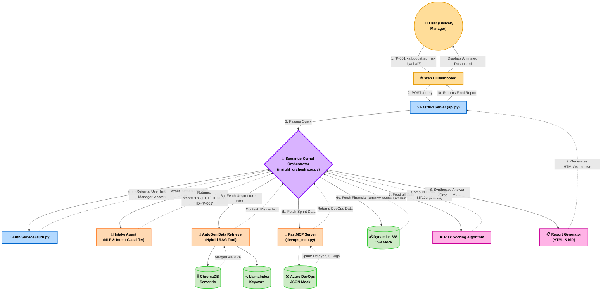

# Complete Project Architecture & Request Lifecycle

This diagram illustrates the full end-to-end architecture of the **Intelligent Client Delivery Agent**. The numbered steps (1-10) trace the exact journey of a single user query through the system.

### Legend of Operations
- **Yellow:** User Interaction Layer
- **Blue:** Security and API Gateway
- **Purple:** The Core Orchestrator (The "Boss")
- **Orange:** The Worker AI Agents
- **Green:** The Grounding Data Sources
- **Pink:** Processing and Report Generation
