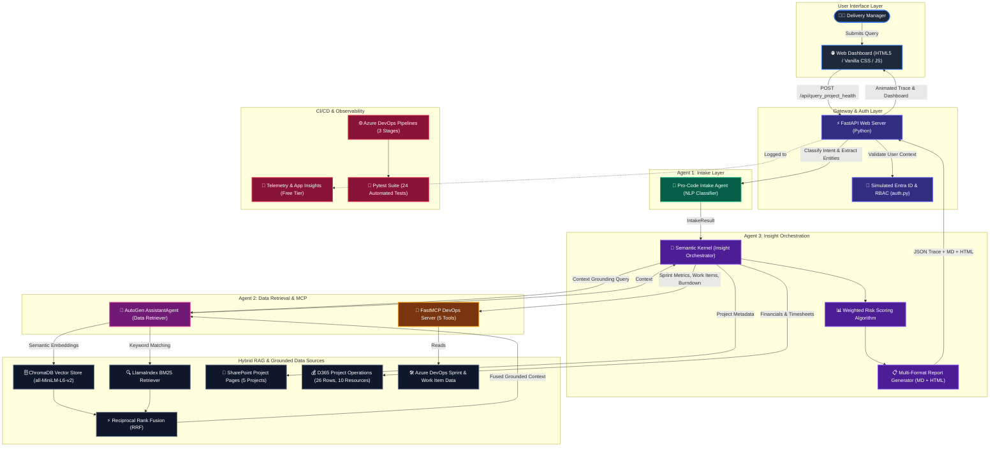
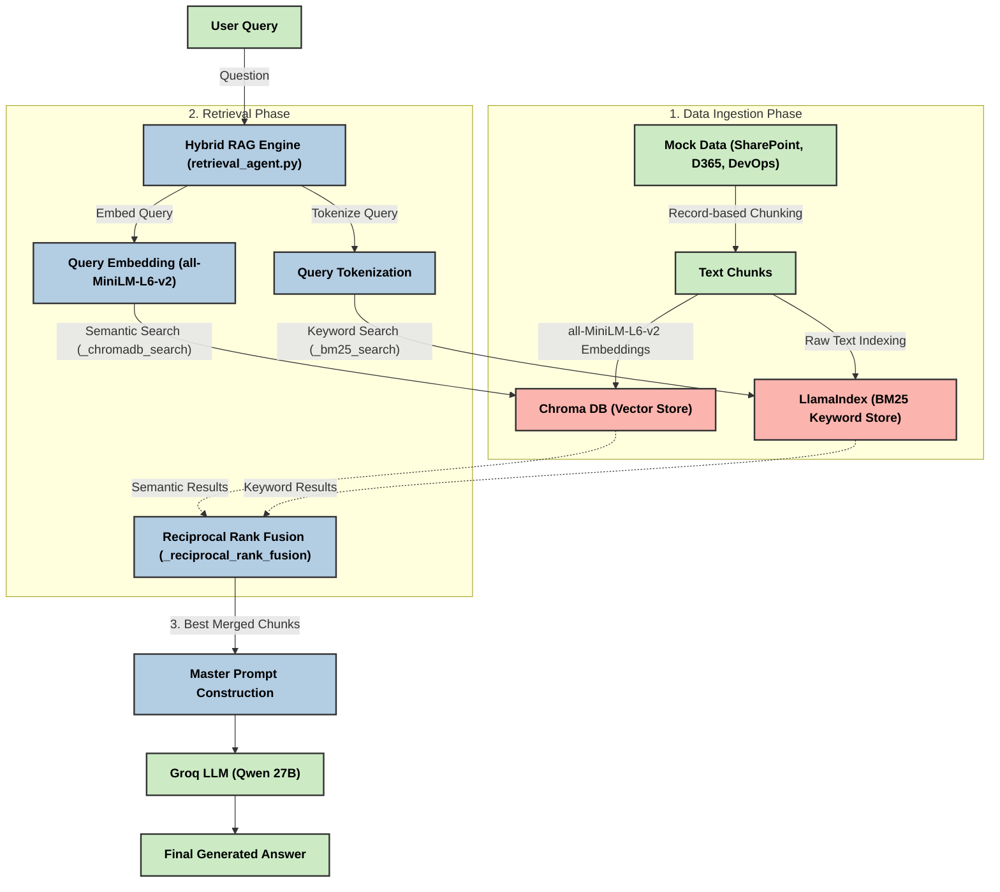

# Intelligent Client Delivery Agent: Architecture & Deep Dive

This document contains the complete visual architecture and an in-depth technical breakdown of every component in the Intelligent Client Delivery Agent project.

## Architecture Diagram

---

## Hybrid RAG Architecture

This diagram details how the Data Retrieval Agent executes Hybrid RAG by combining Semantic Vectors (ChromaDB) with Keyword Matching (LlamaIndex BM25) and applying Reciprocal Rank Fusion (RRF).

---

## Technical Component Breakdown

### 1. User Interface Layer
- **Pro-Code Web Dashboard:** Built with HTML, Vanilla CSS, and JavaScript without third-party framework overhead.
- **Agent Execution Trace:** Visualizes the agent's 10-step chain of thought in real-time, displaying elapsed milliseconds and individual agent statuses.
- **Three Core Panels:**
  - **Agent Chat:** Interactive natural language interface with 6 instant query chips.
  - **Data Sources:** Live view of connected data sources with ingestion metrics.
  - **Architecture:** Architectural diagram and tech stack mapping (Free Stack vs Step Up).

### 2. Gateway & Authentication Layer
- **FastAPI Backend:** Asynchronous Python API server with CORS middleware, request timing headers, and OpenAPI documentation.
- **Simulated Entra ID RBAC:** Validates `user_id` context variables, assigns roles (`manager`, `admin`, `viewer`), and restricts project access to authorized managers.

### 3. Agent 1: Intake Agent (Pro-Code NLP Classifier)
- **Zero Low-Code Dependencies:** Built in pure Python, eliminating the need for Copilot Studio.
- **6 Query Intents:** Accurately classifies queries across `portfolio_overview`, `project_health`, `budget_query`, `risk_query`, `sprint_query`, and `team_query`.
- **Entity Extraction:** Maps colloquial project names and codenames to canonical IDs (`P-001` through `P-005`).

### 4. Agent 2: Data Retrieval Agent & FastMCP
- **AutoGen AssistantAgent:** Encapsulates the hybrid retrieval tools for conversational agent workflows.
- **Hybrid RAG:** Fuses dense semantic vector search (ChromaDB + HuggingFace `all-MiniLM-L6-v2`) with sparse keyword search (LlamaIndex BM25) using Reciprocal Rank Fusion (RRF).
- **FastMCP Tool Server:** Exposes 5 MCP tools (`get_sprint_status`, `get_all_sprint_statuses`, `get_work_items`, `get_sprint_burndown`, `get_team_members`).

### 5. Agent 3: Insight Orchestrator (Semantic Kernel)
- **Microsoft Semantic Kernel:** Initializes a native `ProjectHealthPlugin` with the `@kernel_function` decorator.
- **Multi-Factor Risk Scoring:** Computes risk scores (0–100) using a weighted algorithm:
  - Active Blockers: 30%
  - Open Bug Delta: 20%
  - Sprint Velocity Deficit: 20%
  - Budget Overrun: 30%
- **Dual Format Reporting:** Synthesizes structured Markdown for interactive chat and generates standalone styled HTML reports.

### 6. Observability & CI/CD
- **Application Insights (Free Tier):** Logs custom events, dependency timing, API requests, and exception stack traces.
- **Azure DevOps Pipelines:** A 3-stage CI/CD pipeline (`BuildAndTest` → `DeployToTest` → `PromoteToProduction`) with flake8 linting and automated test runs.
- **24 Pytest Unit Tests:** Validates authentication, intent classification, entity extraction, and risk calculation.
